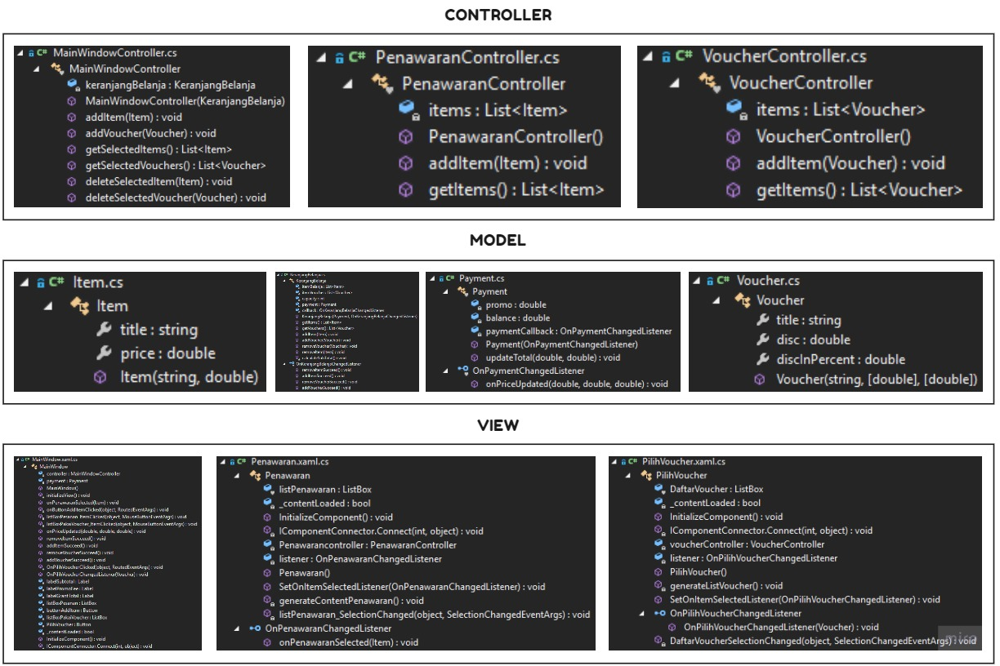
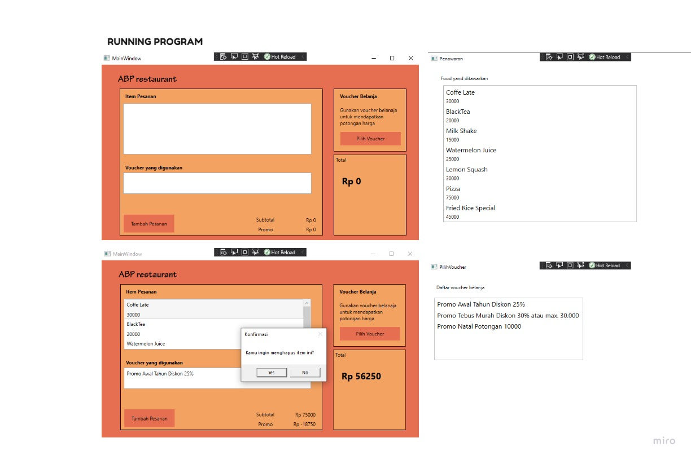

## Nama : Arya Bakti Pratama
## NIM  : 19.11.2837


# Restaurant
Aplikasi sederhana sesuai studi kasus yang diberikan dosen untuk memenuhi tugas UAS. Aplikasi ini berfungsi untuk simulasi pembelian makanan/minuman dengan implementasi promo/voucher.
## Scope and Functionalities
- User dapat melihat daftar makanan yang ditawarkan
- User dapat memasukkan atau menghapus makanan pilihan ke dalam keranjang
- User dapat melihat subtotal makanan yang terdapat pada keranjang
- User dapat melihat daftar voucher yang ditawarkan
- User dapat menggunakan salah satu voucher
- User dapat melihat harga total termasuk potongannya
## How Does it works?
- ### Class Diagram :

1. Apa saja model yang digunakan pada project ini?
    saya membuat 4 model yaitu model item untuk makanan atau minuman, model keranjangBelanja untuk menaruh pembelian, model payment untuk mengurusi total harga beli, dan model Voucher untuk daftar vouchernya.
2. Apa fungsi MainWindowController.cs?
    controller ini digunakan untuk melakukan beberapa operasi. Seperti menambahkan item dan voucher, menghapus item dan voucher, lalu untuk mendapatkan data list dari item yang dibeli dan voucher yang digunakan.
3. Alur programn :
    dimulai dari Penawaran.xaml.cs, disini dibuat object item dan akan ditambahkan pada sebuah list, yang nantinya akan ditampilkan pada sebuah list box
```csharp
 private void generateContentPenawaran()
        {
            Item coffeLate = new Item("Coffe Late", 30000);
            Item blackTea = new Item("BlackTea", 20000);
            Item milkShake = new Item("Milk Shake", 15000);
            Item watermelonJuice = new Item("Watermelon Juice", 25000);
            Item lemonSquash = new Item("Lemon Squash", 30000);
            Item pizza = new Item("Pizza", 75000);
            Item friedRice = new Item("Fried Rice Special", 45000);

            Penawarancontroller.addItem(coffeLate);
            Penawarancontroller.addItem(blackTea);
            Penawarancontroller.addItem(milkShake);
            Penawarancontroller.addItem(watermelonJuice);
            Penawarancontroller.addItem(lemonSquash);
            Penawarancontroller.addItem(pizza);
            Penawarancontroller.addItem(friedRice);

            listPenawaran.Items.Refresh();
        }
```
lalu pada PilihVoucher.xaml.cs, disini fungsinya sama dengan Penawaran.xaml.cs. Kita membuat object voucher dari model Voucher tadi, dan dimasukkan kedalam list serta ditampilkan pada listbox
```csharp
private void generateListVoucher()
        {
            Model.Voucher awalTahun = new Model.Voucher(title: "Promo Awal Tahun Diskon 25%", discInPercent: 25);
            Model.Voucher tebusMurah = new Model.Voucher(title: "Promo Tebus Murah Diskon 30% atau max. 30.000", discInPercent: 30);
            Model.Voucher promoNatal = new Model.Voucher(title: "Promo Natal Potongan 10000", disc: 10000);

            voucherController.addItem(awalTahun);
            voucherController.addItem(tebusMurah);
            voucherController.addItem(promoNatal);

            DaftarVoucher.Items.Refresh();
        }
```
lalu pada MainWindow.xaml.cs terdapat inisialisasi dan membuat beberapa instance. Kita membuat instance dari payment yang akan digunakan pada keranjangBelanja. Nah keranjangBelanja ini juga akan digunakan pada mainWindowController.
```csharp
public MainWindow()
        {
            InitializeComponent();

            payment = new Payment(this);

            KeranjangBelanja keranjangBelanja = new KeranjangBelanja(payment, this);

            controller = new MainWindowController(keranjangBelanja);

            listBoxPesanan.ItemsSource = controller.getSelectedItems();
            listBoxPakaiVoucher.ItemsSource = controller.getSelectedVouchers();

            initializeView();

        }
```
selain itu juga dibuatkan 2 baris kode untuk memasukkan data list item dan voucher ke masing - masing listbox. Selain pembuatan instance juga terdapat beberapa operasi yang dilakukan.

## Running Aps :

## Demo Aps :


